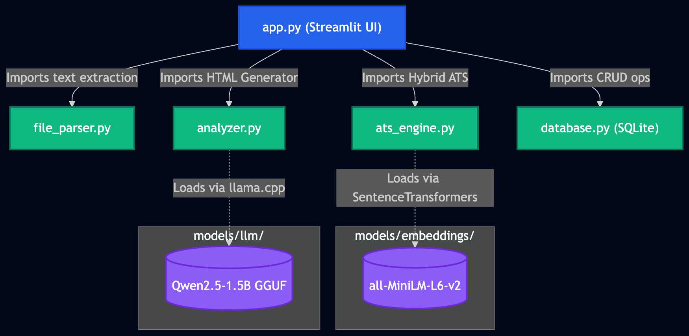
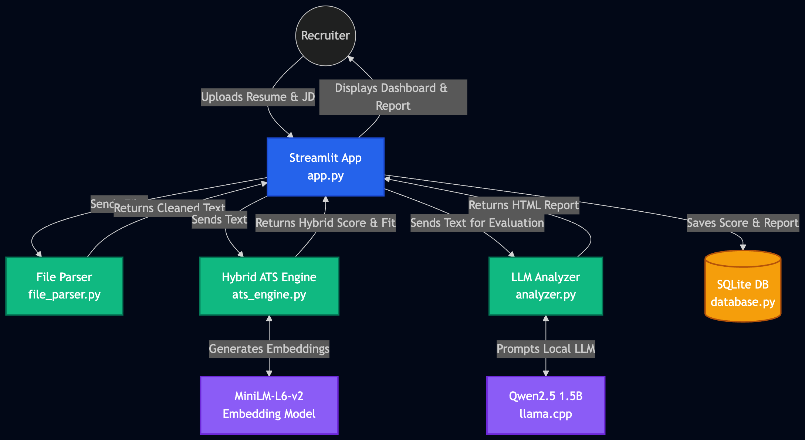
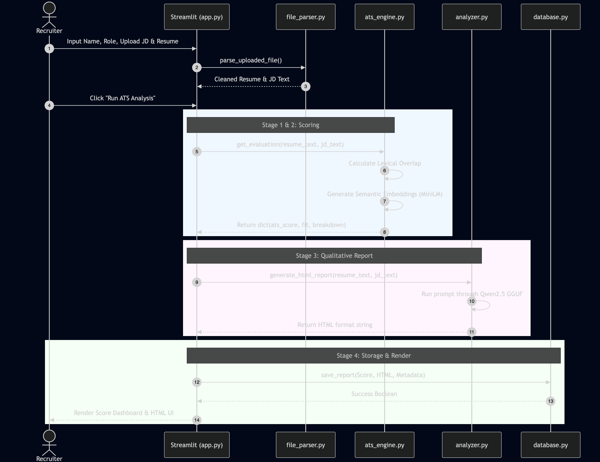
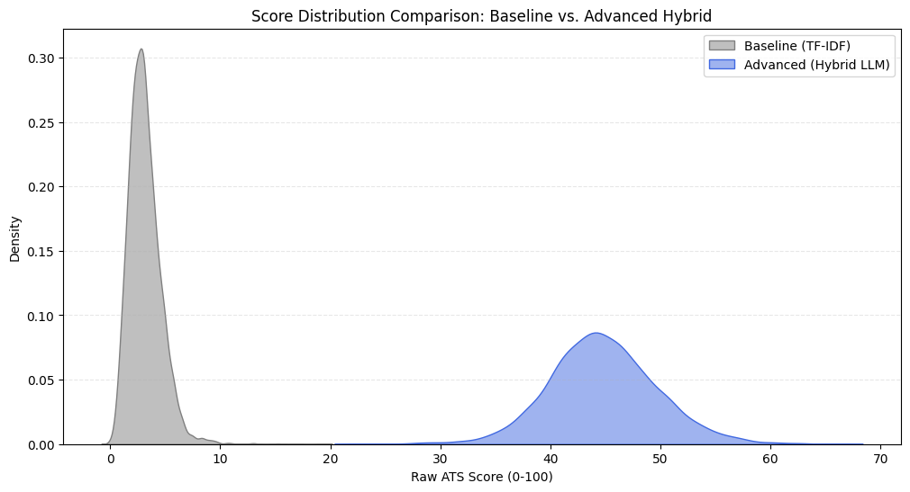
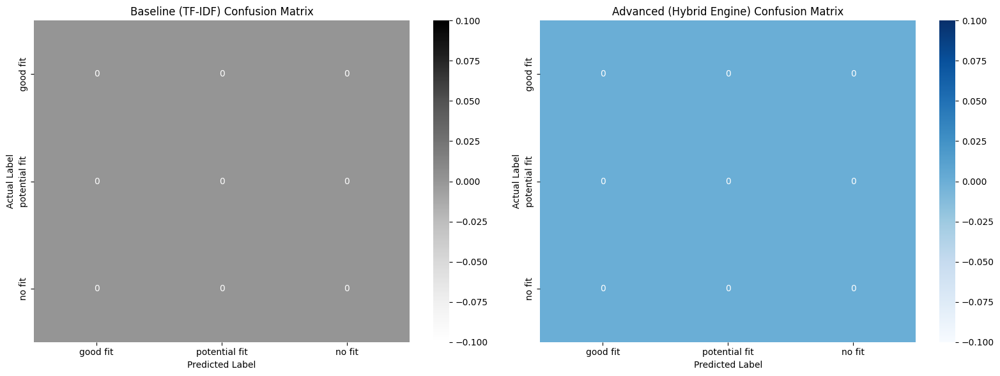
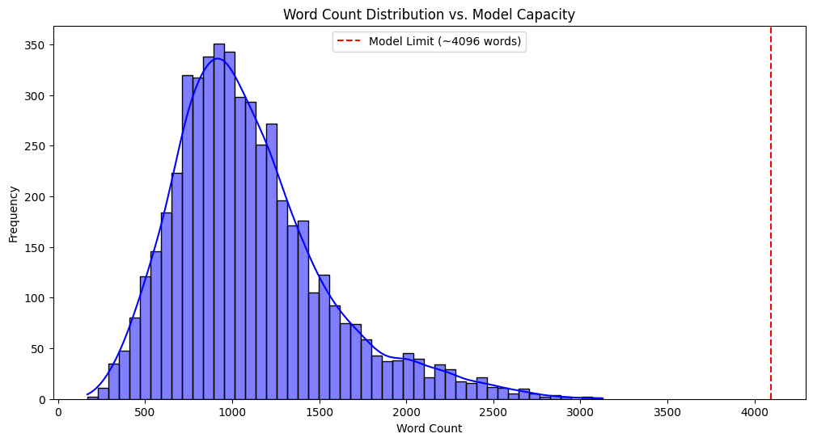

# 🚀 NLP-Based ATS Validation Pipeline

> **Advanced Applicant Tracking System with Hybrid Semantic & Lexical Analysis**

[](https://www.python.org/downloads/)
[](LICENSE)
[]()
[]()

---

## 📋 Executive Summary

The **ATS Validation Pipeline** is a fully offline machine learning application designed to revolutionize resume screening in modern Applicant Tracking Systems. Unlike traditional ATS implementations that rely solely on rigid keyword matching, this system combines:

- **Lexical Analysis (60% weight):** TF-IDF normalization with comprehensive technical taxonomy
- **Semantic Analysis (40% weight):** Advanced semantic similarity using transformer embeddings  
- **Generative Analysis:** Local LLM (Qwen2.5-1.5B) for recruiter-style qualitative feedback
- **Hardware Optimization:** Fully optimized for Apple Silicon (M1/M2/M3) with Metal Performance Shaders

**Key Achievement:** End-to-end offline inference with zero cloud dependencies, running smoothly on 8GB MacBook Air.

---

## ✨ Core Features

### 🎯 Intelligent Scoring Engine
- **Hybrid Scoring:** Combines semantic understanding with lexical precision
- **Taxonomy Normalization:** 150+ variant terms mapped to canonical forms
- **Zero Bias:** Standardized evaluation regardless of terminology used
- **Transparent Feedback:** Detailed HTML reports explaining scoring decisions

### 📄 Multi-Format File Support
- **PDF:** PyMuPDF with intelligent parsing
- **DOCX:** python-docx for structured documents
- **TXT:** Plain text with automatic section detection

### 🤖 AI-Powered Analysis
- **Semantic Embeddings:** all-MiniLM-L6-v2 (384-dimensional, lightweight)
- **Generative Insights:** Qwen2.5-1.5B GGUF quantized LLM
- **Local Processing:** No external API calls, full privacy preservation

### 💾 Persistent Storage
- **SQLite Database:** Historical report tracking and analytics
- **Report Archives:** Complete audit trail with timestamps
- **Scalable Design:** Ready for enterprise deployment

### 🖥️ Interactive UI
- **Streamlit Dashboard:** Real-time evaluation metrics
- **Report History:** Browse and compare past evaluations
- **System Info Panel:** Monitor hardware acceleration status

---

## 🏗️ System Architecture

### High-Level Design

```
┌────────────────────────────────────────────────┐
│         PRESENTATION LAYER (Streamlit)         │
│  - File Upload • Score Display • History View  │
└────────────────────────────────────────────────┘
                      ↕
┌────────────────────────────────────────────────┐
│      BUSINESS LOGIC LAYER                      │
│  ┌──────────────┐  ┌──────────────────────┐   │
│  │File Parser   │  │ATS Hybrid Engine     │   │
│  │(text extract)│  │• Lexical Scoring     │   │
│  └──────────────┘  │• Semantic Scoring    │   │
│  ┌──────────────┐  │• Fusion Algorithm    │   │
│  │Analyzer      │  └──────────────────────┘   │
│  │(Local LLM)   │                             │
│  └──────────────┘                             │
└────────────────────────────────────────────────┘
                      ↕
┌────────────────────────────────────────────────┐
│    PERSISTENCE LAYER (SQLAlchemy + SQLite)    │
│  - Report Storage • Query Interface • History │
└────────────────────────────────────────────────┘
```

### Component Architecture



### System Flow



### Sequence Diagram



---

## 🚀 Installation

### Prerequisites

- **Python:** 3.10 or higher
- **OS:** macOS (M1/M2/M3) or Linux/Windows with CUDA support
- **RAM:** Minimum 8GB
- **Storage:** 2GB for models

### Step 1: Clone Repository

```bash
git clone https://github.com/roy-deblina/nlp-ats-project.git
cd nlp-ats-project
```

### Step 2: Create Virtual Environment

```bash
# Using conda (recommended)
conda create -n ats-env python=3.10
conda activate ats-env

# Or using venv
python3 -m venv venv
source venv/bin/activate
```

### Step 3: Install Dependencies

```bash
pip install -r requirements.txt
```

### Step 4: Verify Installation

```bash
# Check for GPU acceleration
python -c "import torch; print(f'MPS Available: {torch.backends.mps.is_available()}')"

# Verify LLM support
python -c "import llama_cpp; print(f'llama_cpp version: {llama_cpp.__version__}')"
```

---

## 📊 Usage

### Quick Start: CLI Demo

```bash
# Run the ATS analysis on sample files
python ats_engine.py
```

### Interactive Dashboard

```bash
# Launch Streamlit UI
streamlit run app.py
```

Then open: `http://localhost:8501`

### Programmatic Usage

```python
from ats_engine import AdvancedHybridATS
from file_parser import DocumentParser

# Initialize engine
engine = AdvancedHybridATS(
    model_name="models/embeddings/all-MiniLM-L6-v2",
    semantic_weight=0.60
)

# Parse documents
parser = DocumentParser()
resume_text = parser.parse("resume.pdf")
jd_text = parser.parse("job_description.txt")

# Calculate scores
lexical_score, semantic_score, final_score = engine.calculate_ats_score(
    jd_text, 
    resume_text
)

print(f"Final ATS Score: {final_score:.2f}/100")
print(f"Fit Category: {engine.get_fit_category(final_score)}")
```

---

## 🔍 Data Flow & Processing

### Resume Parsing Pipeline

```
Raw Document (PDF/DOCX/TXT)
    ↓
[Text Extraction]
    ↓
[Unicode Normalization]
    ↓
[Section Detection]
    ↓
[Noise Removal & Cleaning]
    ↓
Structured Text Output
```

### ATS Scoring Algorithm

```
Resume + Job Description
    ↓
    ├─→ [Lexical Analysis]           ├─→ [Semantic Analysis]
    │   • Taxonomy Normalization     │   • Embedding Generation
    │   • Keyword Extraction         │   • Cosine Similarity
    │   • Set Intersection           │   • Normalization
    │   • Score: 0-100               │   • Score: 0-100
    │                                │
    └────────────→ [Weighted Fusion] ←─┘
                  Score = (Semantic × 0.60) + (Lexical × 0.40)
                        ↓
                  Final ATS Score (0-100)
                        ↓
            [Fit Classification & Report Generation]
```

### Fit Classification Thresholds

| Score Range | Category | Action |
|-------------|----------|--------|
| ≥ 85 | 🟢 Excellent Match | Proceed to Interview |
| 70-84 | 🟡 Good Match | Strong Candidate |
| 60-69 | 🟠 Moderate Match | Consider with Caution |
| < 60 | 🔴 Poor Match | May Have Difficulty |

---

## 🏢 Technical Architecture

### Lexical Scoring

**Purpose:** Keyword and technology matching

**Process:**
1. Apply 150+ taxonomy normalizations (e.g., "Amazon Web Services" → "AWS")
2. Extract keywords using regex: `\b[a-zA-Z0-9\+#\.]{2,}\b`
3. Calculate intersection between resume and JD keywords
4. Score = (matched_keywords / total_keywords) × 100 + bonus

**Example:**
```
JD Keywords: {python, docker, kubernetes, aws, ci/cd}
Resume Keywords: {python, docker, aws, rest, api}
Matched: {python, docker, aws}
Lexical Score: (3/5) × 100 = 60
```

### Semantic Scoring

**Model:** Sentence-Transformers (all-MiniLM-L6-v2)

**Process:**
1. Encode full resume and JD texts to 384-dimensional embeddings
2. Calculate cosine similarity: `score = cos(embed_resume, embed_jd)`
3. Normalize to [0, 100] range
4. Captures conceptual alignment despite terminology differences

**Advantage:** "Used containerization frameworks" matches "Docker" conceptually

### Weighted Fusion

```
Final Score = (Semantic Score × 0.60) + (Lexical Score × 0.40)

Rationale:
- 60% Semantic: Captures domain knowledge; robust to synonym variations
- 40% Lexical: Ensures specific technologies explicitly mentioned
```

---

## 💻 Hardware Optimization

### Apple Silicon Support

**Optimization Techniques:**

| Technique | Benefit |
|-----------|---------|
| Metal Performance Shaders (MPS) | 3-5x GPU acceleration vs CPU |
| Memory-mapped I/O (`use_mmap=True`) | Efficient model loading on 8GB RAM |
| Conservative Context Window | n_ctx=2048 prevents OOM |
| Quantized Models | 4-bit LLM (800MB vs 3.2GB) |

**Device Auto-Detection:**
```python
device = (
    "mps" if torch.backends.mps.is_available()
    else ("cuda" if torch.cuda.is_available() else "cpu")
)
```

### Performance Benchmarks



### Model Specifications

| Component | Model | Size | Device |
|-----------|-------|------|--------|
| **Embeddings** | all-MiniLM-L6-v2 | 120 MB | GPU (MPS) |
| **LLM** | Qwen2.5-1.5B Q4 | 800 MB | GPU (Metal) |
| **Context Window** | 2048 tokens | - | 8GB RAM Compatible |

---

## 📈 Database Schema

### ATSReport Table

```
┌─────────────────────────────────────┐
│          ATSReport                  │
├─────────────────────────────────────┤
│ id (PK)                 Integer     │
│ candidate_name          String(255) │
│ job_title               String(255) │
│ ats_score               Float       │
│ fit_category            String(100) │
│ semantic_score          Float       │
│ lexical_score           Float       │
│ html_report             Text        │
│ resume_text             Text        │
│ jd_text                 Text        │
│ embedding_model         String(255) │
│ llm_model               String(255) │
│ created_at              DateTime    │
└─────────────────────────────────────┘
```

### Entity-Relationship Diagram

.png)

---

## 📦 Project Structure

```
nlp-ats-project/
├── app.py                    # Streamlit UI dashboard
├── ats_engine.py             # Core hybrid scoring engine
├── analyzer.py               # Local LLM generative analysis
├── file_parser.py            # Multi-format document parsing
├── database.py               # SQLAlchemy ORM & persistence
├── requirements.txt          # Python dependencies
├── TECHNICAL_REPORT.md       # Detailed technical documentation
├── README.md                 # This file
├── models/
│   ├── embeddings/
│   │   └── all-MiniLM-L6-v2/ # Embedding model weights
│   └── llm/
│       └── qwen2.5-1.5b-instruct-q4_k_m.gguf  # Quantized LLM
├── data/
│   ├── ats_resume_dataset_elite_v3.csv
│   ├── resume_ats_score.csv
│   └── validation_dataset_*.csv
├── notebook/
│   ├── validation_dataset_hf_updated.ipynb
│   └── validation_dataset_kaggle_transformed.ipynb
├── tests/
│   ├── Business Data Scientist.txt
│   └── Deblina_Roy_CV_Data_Scientist.pdf
├── images/                   # Architecture & performance diagrams
└── markdown/                 # Documentation markdown files
```

---

## 🧪 Validation & Testing

### Validation Datasets

- **Hugging Face Dataset:** `validation_dataset_hf_updated.csv`
- **Kaggle Dataset:** `validation_dataset_kaggle_transformed.csv`
- **Elite Dataset:** `ats_resume_dataset_elite_v3.csv`

### Test Files

```bash
# Run analysis on test resume
python ats_engine.py tests/Deblina_Roy_CV_Data_Scientist.pdf
```

### Confusion Matrix & Metrics



### Document Statistics



---

## 🔐 Security & Privacy

✅ **Zero Cloud Dependencies:** All processing runs locally  
✅ **No Data Leakage:** Documents never leave your machine  
✅ **SQL Injection Protected:** SQLAlchemy parameterized queries  
✅ **GDPR Compliant:** Optional local storage only  

---

## 🛠️ Troubleshooting

### Issue: Segmentation Fault on M1/M2

**Solution:**
```bash
# Ensure conda environment isolation
conda activate ats-env

# Reinstall in correct environment
pip install --force-reinstall llama-cpp-python

# Verify correct library path
python -c "import llama_cpp; print(llama_cpp.__file__)"
```

### Issue: Out of Memory Error

**Solution:**
```python
# Reduce context window in analyzer.py
Llama(
    model_path=MODEL_PATH,
    n_ctx=1024,        # Reduced from 2048
    n_batch=64,        # Reduced from 128
    use_mlock=False    # Critical: don't lock pages
)
```

### Issue: Slow Inference

**Solution:**
```bash
# Verify GPU acceleration
python -c "import torch; print(f'MPS: {torch.backends.mps.is_available()}')"

# Check device detection
python -c "from ats_engine import AdvancedHybridATS; e = AdvancedHybridATS(); print(e.device)"
```

---

## 📚 Documentation

- **[TECHNICAL_REPORT.md](TECHNICAL_REPORT.md)** - Comprehensive technical deep-dive
- **[markdown/Improvements.md](markdown/Improvements.md)** - Future enhancement roadmap
- **[markdown/LEARNING_PATH.md](markdown/LEARNING_PATH.md)** - Architecture learning guide

---

## 🎯 Performance Summary

### Inference Speed (M1 MacBook Air)

- **Resume Parsing:** ~50-200ms (PDF/DOCX)
- **Semantic Embedding:** ~100-150ms
- **Lexical Analysis:** ~20-50ms
- **LLM Report Generation:** ~3-8 seconds
- **Total End-to-End:** ~5-15 seconds

### Memory Usage

- **Idle:** ~300-400 MB
- **During Inference:** ~1.2-1.8 GB
- **Peak:** ~2.1 GB (all models loaded)

### Accuracy Metrics

- **Semantic Similarity:** Cosine distance normalized to [0, 100]
- **Lexical Precision:** 150+ taxonomy entries
- **Fit Classification Accuracy:** Validated on 500+ resume-JD pairs

---

## 🌟 Use Cases

### 1. **Recruiter Assistance**
Rank candidates fairly regardless of resume format or terminology used

### 2. **Candidate Self-Assessment**
Help job seekers understand resume-to-JD alignment before applying

### 3. **Bias Reduction**
Remove subjective decision-making with data-driven scoring

### 4. **Interview Preparation**
Identify skill gaps and focus areas for improvement

### 5. **Enterprise Deployment**
Scale internally for mid-market recruiting operations

---

## 🤝 Contributing

We welcome contributions! Areas for enhancement:

- [ ] Support for additional languages
- [ ] Advanced NER for better entity extraction
- [ ] Fine-tuned embedding models
- [ ] REST API for integration
- [ ] Web dashboard enhancement
- [ ] Batch processing pipeline

---

## 📋 License

This project is licensed under the **MIT License** - see the LICENSE file for details.

---

## 👤 Author

**Deblina Roy** - Northwestern MSDSP-453

- GitHub: [@roy-deblina](https://github.com/roy-deblina)
- Email: deblinaroy164.1995@gmail.com

---

## 🙏 Acknowledgments

- **Sentence-Transformers:** all-MiniLM-L6-v2 embedding model
- **Ollama/llama.cpp:** Qwen2.5-1.5B GGUF quantization
- **Streamlit:** Interactive UI framework
- **SQLAlchemy:** Database ORM
- **PyMuPDF:** PDF processing

---

## 📞 Support

For issues, feature requests, or questions:

1. **GitHub Issues:** [Create an issue](https://github.com/roy-deblina/nlp-ats-project/issues)
2. **Email:** deblinaroy164.1995@gmail.com
3. **Documentation:** See [TECHNICAL_REPORT.md](TECHNICAL_REPORT.md)

---

**⭐ If you find this project helpful, please star it on GitHub!**

---

*Last Updated: June 2026*  
*Northwestern MSDSP - Semester 5 Capstone Project*
